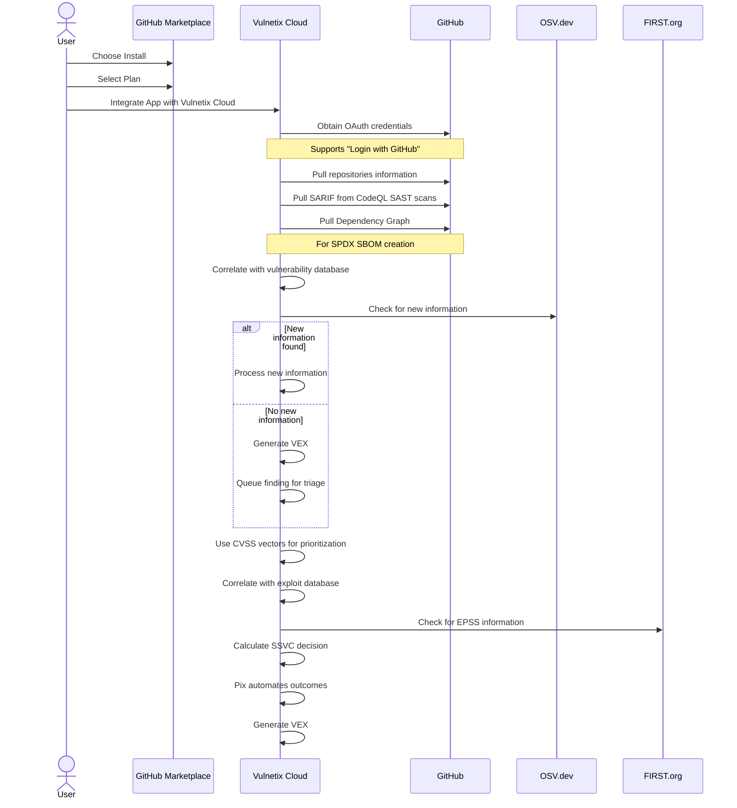

Here's a brief explanation of Vulnetix as of Sept

This sequence diagram illustrates from the user's initial actions in the GitHub Marketplace to the final steps performed by Vulnetix Cloud. 

Here's a brief explanation of the diagram:

1. The user starts by choosing to install and selecting a plan in the GitHub Marketplace.
2. The user then integrates the app with Vulnetix Cloud.
3. Vulnetix Cloud obtains OAuth credentials from GitHub for "Login with GitHub" functionality.
4. Vulnetix pulls various data from GitHub, including repository information, SARIF from CodeQL scans, and the Dependency Graph.
5. Vulnetix then performs several internal processes:
   - Correlates data with its vulnerability database
   - Checks for new information from OSV.dev
   - Uses CVSS vectors for prioritisation
   - Correlates with its exploit database
   - Checks for EPSS information from FIRST.org
   - Calculates an SSVC decision
6. Throughout the process, when there's no new information, Vulnetix generates a VEX and queues the finding for triage.
7. Finally, Pix automates outcomes and provides a VEX.
