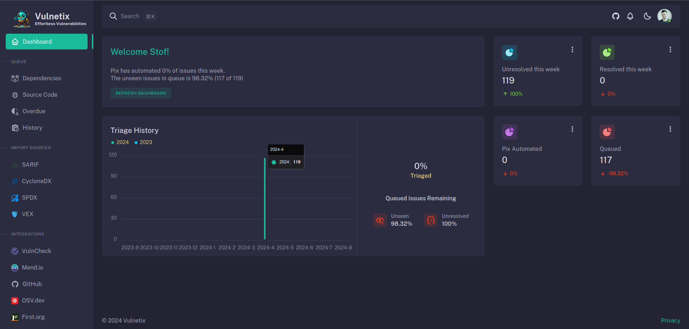
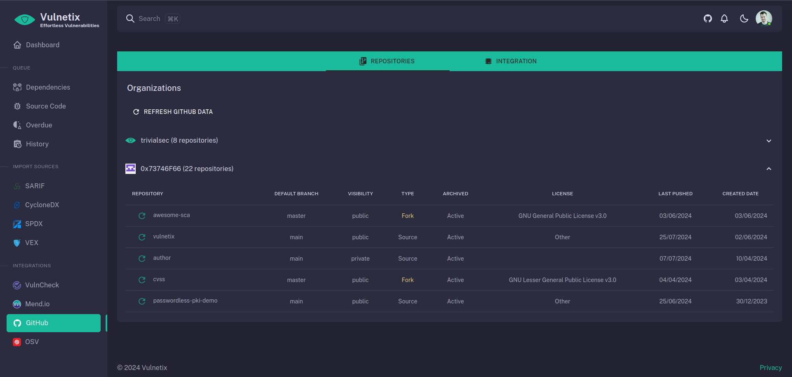
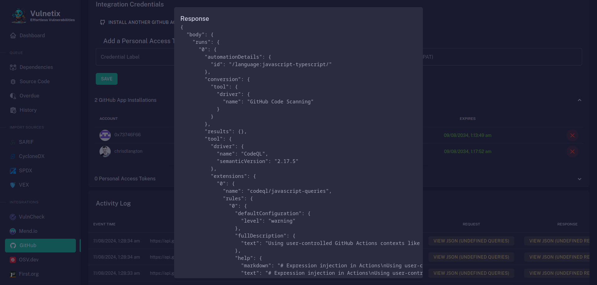
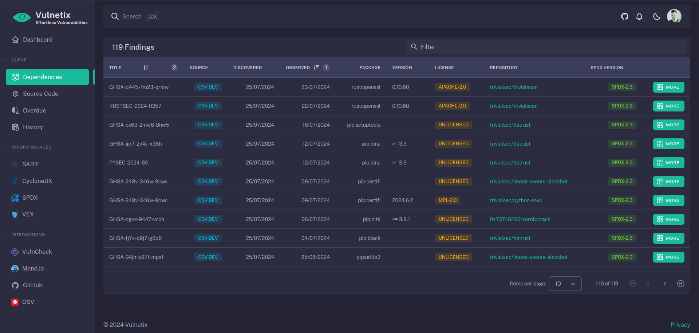
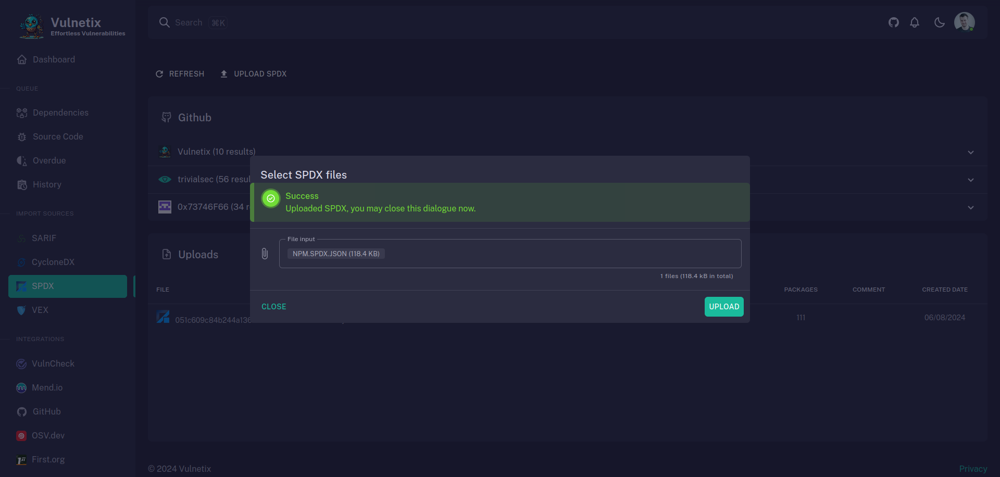
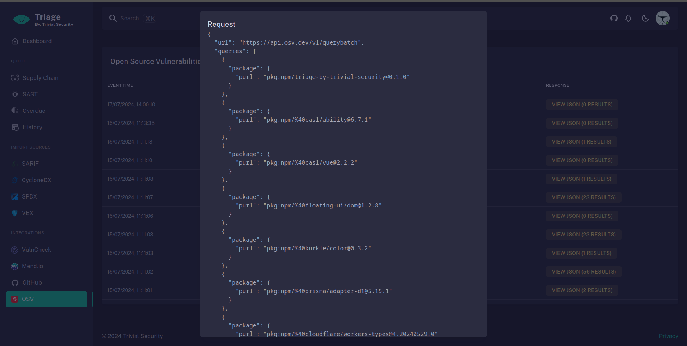

# Vulnetix

 

### Automate vulnerability triage which prioritizes remediation over discovery

**Early Adopters needed**

Please install our [GitHub App](https://github.com/marketplace/vulnetix).

This is a preview, under active development, so you will encounter bugs while we complete the features.

> **Note**: If you install now, you will forever gain access to Vulnetix - this is by design for all GitHub Apps that add a paid plan later.

#### The Problem

Organizations producing software face an ever-growing number of vulnerabilities. Even unchanged software can encounter new vulnerabilities due to the dependencies and their own nested dependencies. This creates a deep and complex web of risks that can become unmanageable. As the codebase grows, so does the number of vulnerabilities, overwhelming vulnerability management and software development teams.

#### The Challenge

Globally, as more software is created, the discovery of vulnerabilities increases exponentially. Security teams struggle to keep pace with this rapid growth, losing the ability to manage and mitigate the vulnerabilities effectively. Most security vendors focus on identifying these vulnerabilities or collecting information to enhance reporting, but this approach often adds to the workload without offering a practical solution.

#### The Solution

Vulnetix offers a revolutionary approach to vulnerability management by shifting the focus from discovery to outcomes. Instead of just identifying vulnerabilities, Standards adhering discovery and reporting, with automation to significantly reduce manual effort.

No other tool avoids vendor lock-in by design.

No other founder has automated millions of vulnerability resolutions themselves.

No other security product tries to be invisible to developers while providing unrivaled security assurance.

#### Key Features

- **Automated Remediation Reporting:** Generates VEX (Vulnerability Exploitability eXchange) documents for every finding, focusing on remediation outcomes rather than mere discovery.
- **Efficient Triage:** Creates a queue for human review only when automation is unable to resolve an issue.
- **Outcome-Driven Focus:** Presents only vulnerabilities to human analysts, where automation is unable to remediate them.

#### Benefits

With Vulnetix, streamline your vulnerability management, reduce manual efforts, and maintain a robust security posture. Embrace the future of vulnerability management where automation meets effective risk mitigation, allowing your team to focus on what truly matters: resolving vulnerabilities and securing your software.

## Screenshots

Check the marketplace listing above for more.

## Features

Vulnetix will offer a range of features to streamline vulnerability management:

1. **SBOM**: The app ingests (uploads/webhooks) SPDX and CycloneDX.
2. **Data Enrichment**: Users can BYO optional API keys to enrich their data.
3. **Policy and Compliance**: Ensures policy and compliance adherence using OSCAL.
4. **SAST**: Ingestion (uploads/webhooks) of SARIF format SAST scanner outputs.
5. **GitHub App**: Provides an optional integration interface for SBOM, SPDX, SCA Dependabot alerts, and Secrets Scanning.
6. **SaaS**: Offers a cloud-based dashboard for reporting and manual SBOM Ingestion (uploads/webhooks) for workflows outside GitHub.
7. **VEX**: Utilizes git commit messages following conventional commit messages for VEX creation.
8. **Auditing**: Enable all auditing actions resulting in a VEX through the cloud dashboard.
9. **Standardized Reporting**: All reporting in the cloud dashboard uses SARIF, CycloneDX, and VEX formats, ensuring compatibility with modern tools and avoiding vendor lock-in. Tools producing SBOMs are considered modern, while others are regarded as legacy and need modernization.

## Vulnerability Management

Vulnetix is designed to handle various aspects of vulnerability management effectively. Here are the key data points the app processes:

1. **Fix Intel**: Determines if patching the issue is possible or if fixing requires coding.
2. **Patch Availability**: Checks if a patch is available now.
3. **Auto Patch**: Automatically opens a pull request for available patches.
4. **Vulnerability Enrichment**: Enhances data from CPE, CISA KEV, and published exploit PoCs.
5. **Exploit Status and Maturity**: Tracks the status and maturity of exploits.
6. **Exploitation Awareness**: Monitors if vulnerabilities are known to be exploited via VulnCheck KEV or CISA KEV.
7. **Exploitation Forecast**: Predicts exploitation expectations over the next 30 days using EPSS.
8. **Triage Decisions**: Makes triage decisions using the SSVC framework.
